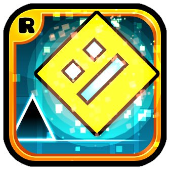

# Player Particles

- __Customize player particles for drag, land etc__

Add a ui and use saved data system to make able u create own particles for basic player effects

- __Particle variables forcing__

In settings you can enable forcing intital gravity/colors/position that getting changed by game while you playing level.

- __.txt file "particle from string" loader__

You can create `EFFECT_NAME.`<cy>`txt`</c> instead of `EFFECT_NAME.plist` to use **string system** instead xml dict. and also u can edit any other effect by that way.

Put txt file to any search paths.

- __Custom texture for particles__

Put `EFFECT_NAME.`<cy>`png`</c> to any search paths.

---

`EFFECT_NAME is an original name of effect like dragEffect, shipDragEffect, landEffect, dashEffect...`

### Search Paths?
The folders where game search for resources:
```
- [config dirs of this mod]
- [your texture pack]
- ./
- ./Resources
- ./geode/resources
and any other paths ever added at runtime.
```




## Build instructions
For more info, see [docs](https://docs.geode-sdk.org/getting-started/create-mod#build)
```sh
# Assuming you have the Geode CLI set up already
geode build
```

### Resources
* [Geode SDK Documentation](https://docs.geode-sdk.org/)
* [Geode SDK Source Code](https://github.com/geode-sdk/geode/)
* [Geode CLI](https://github.com/geode-sdk/cli)
* [Bindings](https://github.com/geode-sdk/bindings/)
* [Dev Tools](https://github.com/geode-sdk/DevTools)
